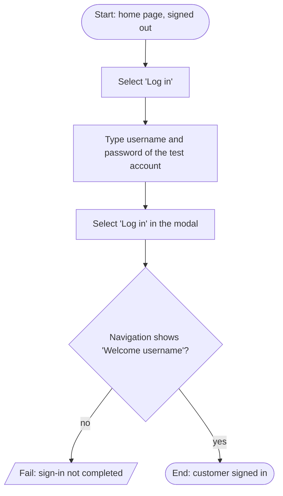

# TC-01 — Sign in with a valid test account

Requirements: PUR-01 · Plan: [demoblaze-purchase.md](../../plans/demoblaze-purchase.md) · Code: `OpenWeb`, `MakeLogin`

```mermaid
flowchart TD
  A([Start: home page, signed out]) --> B[Select 'Log in']
  B --> C[Type username and password of the test account]
  C --> D[Select 'Log in' in the modal]
  D --> E{Navigation shows 'Welcome username'?}
  E -- no --> X[/Fail: sign-in not completed/]
  E -- yes --> Z([End: customer signed in])
```
