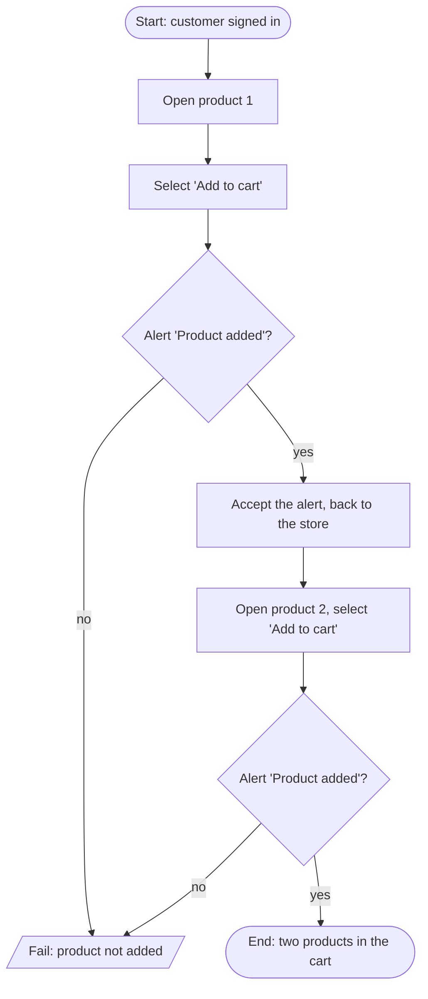

# TC-02 — Add two products

Requirements: PUR-02 · Plan: [demoblaze-purchase.md](../../plans/demoblaze-purchase.md) · Code: `FindProduct`, `AcceptBrowserAlert`

```mermaid
flowchart TD
  A([Start: customer signed in]) --> B[Open product 1]
  B --> C[Select 'Add to cart']
  C --> D{Alert 'Product added'?}
  D -- no --> X[/Fail: product not added/]
  D -- yes --> E[Accept the alert, back to the store]
  E --> F[Open product 2, select 'Add to cart']
  F --> G{Alert 'Product added'?}
  G -- no --> X
  G -- yes --> Z([End: two products in the cart])
```
