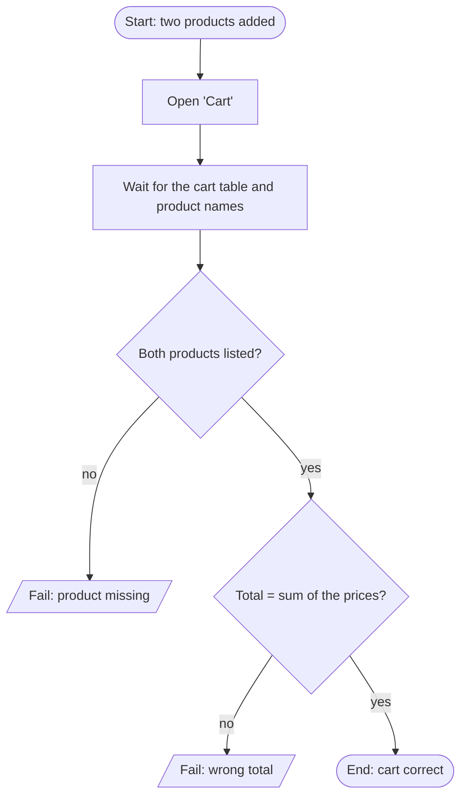

# TC-03 — Cart lists the products and the right total

Requirements: PUR-03 · Plan: [demoblaze-purchase.md](../../plans/demoblaze-purchase.md) · Code: `ViewCart`, `PageCar`

```mermaid
flowchart TD
  A([Start: two products added]) --> B[Open 'Cart']
  B --> C[Wait for the cart table and product names]
  C --> D{Both products listed?}
  D -- no --> X1[/Fail: product missing/]
  D -- yes --> E{Total = sum of the prices?}
  E -- no --> X2[/Fail: wrong total/]
  E -- yes --> Z([End: cart correct])
```
