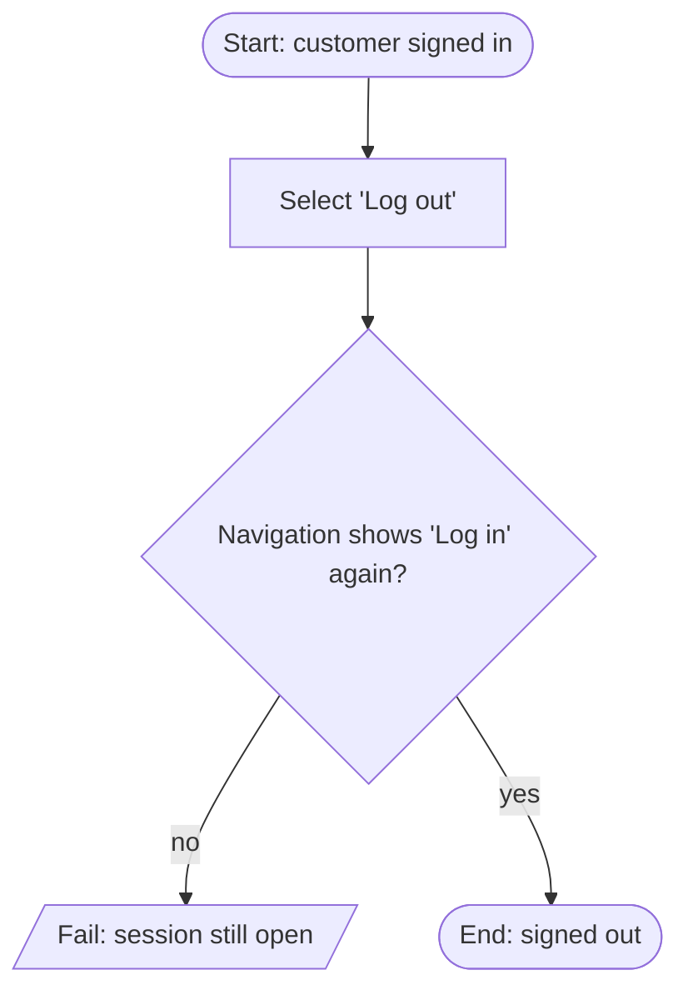

# TC-05 — Sign out

Requirements: PUR-06 · Plan: [demoblaze-purchase.md](../../plans/demoblaze-purchase.md) · Code: `CloseSession`

```mermaid
flowchart TD
  A([Start: customer signed in]) --> B[Select 'Log out']
  B --> C{Navigation shows 'Log in' again?}
  C -- no --> X[/Fail: session still open/]
  C -- yes --> Z([End: signed out])
```
