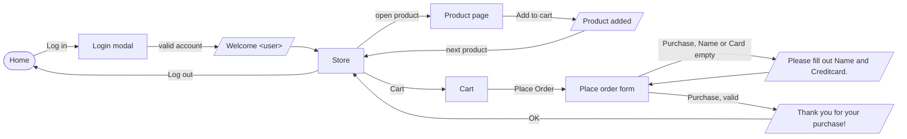

# Demoblaze — purchase journey

```mermaid
flowchart LR
  Home([Home]) -- Log in --> Login[Login modal]
  Login -- valid account --> Welcome[/"Welcome &lt;user&gt;"/]
  Welcome --> Store[Store]
  Store -- open product --> Product[Product page]
  Product -- Add to cart --> Added[/"Product added"/]
  Added -- next product --> Store
  Store -- Cart --> Cart[Cart]
  Cart -- Place Order --> Form[Place order form]
  Form -- Purchase, Name or Card empty --> Error[/"Please fill out Name and Creditcard."/]
  Error --> Form
  Form -- Purchase, valid --> Thanks[/"Thank you for your purchase!"/]
  Thanks -- OK --> Store
  Store -- Log out --> Home
```
